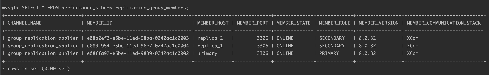
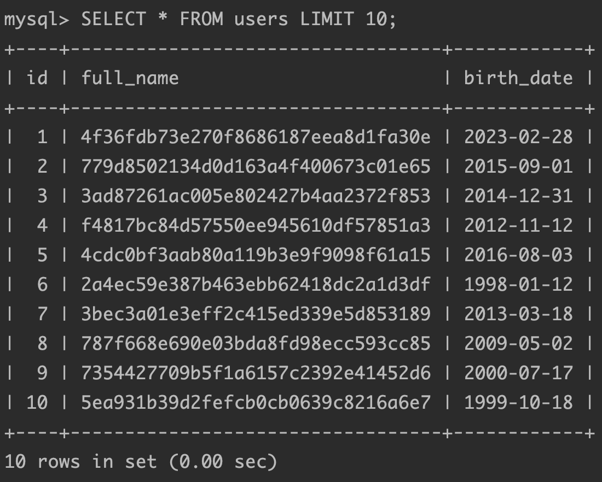
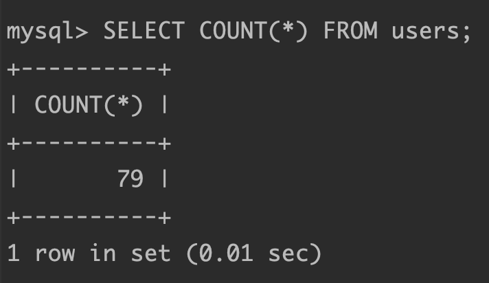
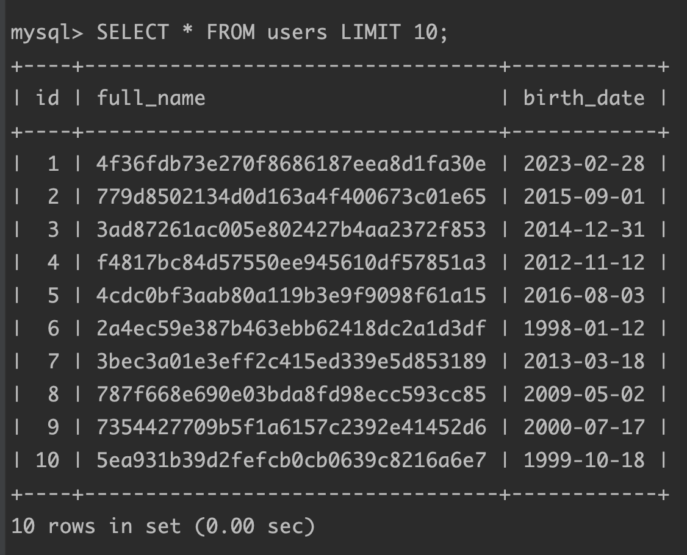
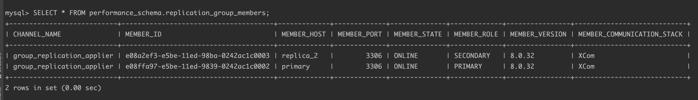
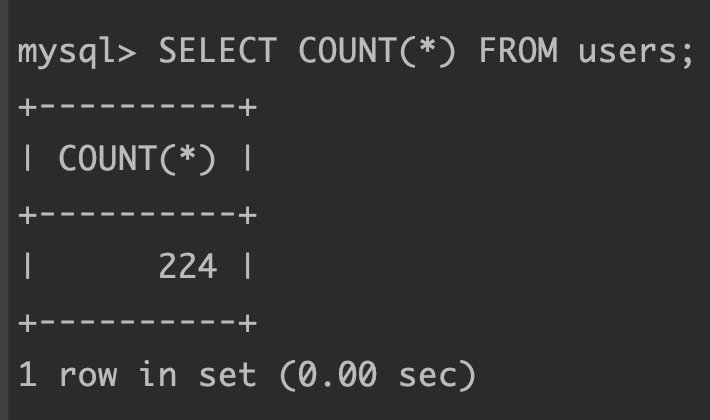
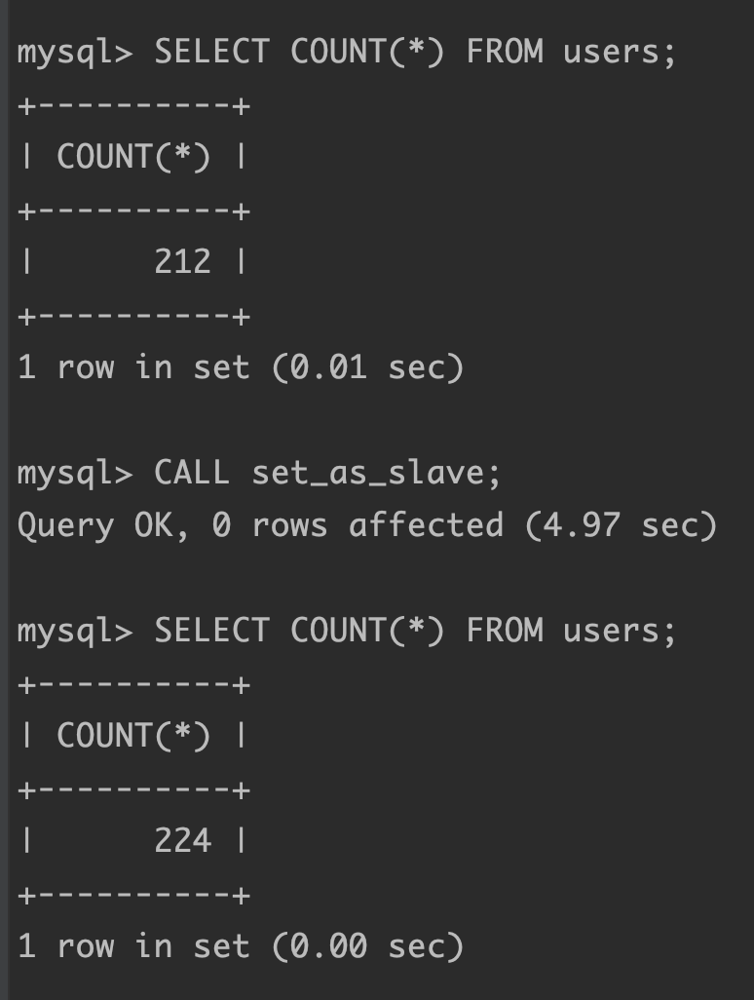
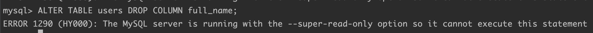

# PRJCTR Homework 20: Database Replication

The task was to set up 3 nodes: primary node (aka master node) 
and 2 replica instances (aka slave nodes). While writing frequently to 
primary node, check: consistency of replica nodes, replica node restart, 
update data or schema on replica node (should fail).

## Prerequisites

* Installed [Docker]().

## Scripts

```bash
$ bash start.sh
```

This script sets up MySQL server nodes with group replication.

```bash
$ bash write.sh
```

This script writes frequently some data to the primary node.

```bash
$ bash clean.sh
```

This script removes containers and volumes.

## Results

### Check whether the replication is working correctly

Execute `start.sh` and connect to the primary node with following command:

```bash
$ docker-compose exec -it primary mysql -uroot -pmypass mydb
```

Check replication and nodes status:

```mysql
mysql> SELECT * FROM performance_schema.replication_group_members;
```

The output should be similar to this:



Start the `write.sh` script in background.

Check data on the primary node:

```sql
mysql> SELECT * FROM users LIMIT 10;
```



```sql
mysql> SELECT COUNT(*) FROM users;
```



Connect to replica nodes to check whether the replication is working correctly.

```bash
$ docker-compose exec -it replica_1 mysql -uroot -pmypass mydb
```

Make sure that replication is working correctly and 
all data on the replica nodes is up-to-date.



### Turn off replica node and boot it again

Turn off one of the replica nodes:

```bash
$ docker-compose stop replica_1
```

On the primary node or any other execute SQL to check replication status:

```mysql
mysql> SELECT * FROM performance_schema.replication_group_members;
```

Only two nodes (primary and 1 replica) are available right now:



Write something to the primary node...

Now we have 224 users on the primary node:



The same on the another active replica node. Start again that node.

After booting it hasn't updated the data because group replication 
is disabled to be turned on after boot.

Execute command to start group replication as replica:

```mysql
mysql> CALL set_as_slave;
```

Now it is up-to-date:



### Trying to update, insert, alter something inside the replica nodes

Connect to replica node and execute insert command:

```mysql
mysql> INSERT INTO users (full_name, birth_date) VALUES ('Slava Ukraine', '1991-08-24');
```

Output:

```
ERROR 1290 (HY000): The MySQL server is running with the --super-read-only option so it cannot execute this statement
```

The same for other non-read actions:


